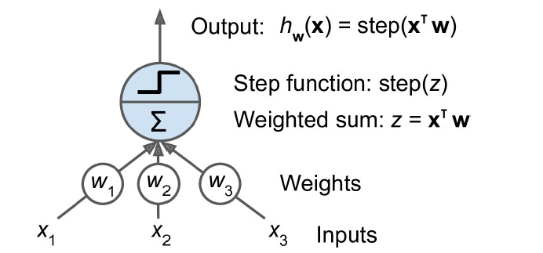
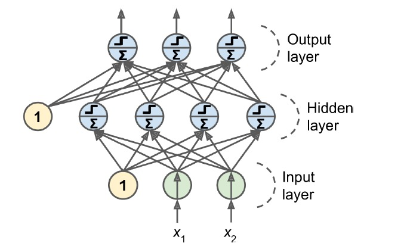

<h1 align = "center"> Spam Classifier </h1>

 

I have developed a spam classifier program in Python which classifies given emails as spam or ham using Multilayer Perceptron (MLP).

<h2> 🌟 Overview</h2>
I used the <a href="https://spamassassin.apache.org/old/publiccorpus/">Apache SpamAssassin public data</a> to train and test a ML-based classification model based on Multilevel Perceptron because of their high efficacy in terms of precision and recall. If you want to run this project, you only need the dependencies (see below). No extra files are needed as the Jupyter notebook will download all the required files.

<h2> :floppy_disk: Project Files Description</h2>

This Project includes 1 executable file, 3 text files as well as 2 directories for training and testing purposes. The description is as follows: 

<h4>Executable Files:</h4>
<ul>
  <li><b>spam-classifier-optimized.ipynb</b> - A  Jupyter Notebook consisiting of all the functions required for training, testing and classification of the emails. Includes all functions required for classification operations.</li>
</ul>

<h4>Output Files:</h4>
<ul>
  <li><b>model.txt</b> - Contains information about the vocabularies of the train set, such as the frequency and conditional probability of each word in Spam and Ham classes.</li>
  <li><b>result.txt</b> - Contains information about the classified emails of the test set.</li>
  <li><b>evaluation.txt</b> - Contains evaluation results table as well as Confusion Matrix of Spam and Ham classes.</li>
</ul>

<h4>Source Directories:</h4>
<ul>
  <li><b>train directory</b> - Includes all emails for the training phase of the program.</li>
  <li><b>test directory</b> - Includes all emails for the testing phase of the program.</li>
</ul>

<h2> 📚 Multilevel Perceptron</h2>

The Perceptron is one of the simplest ANN architectures, invented in 1957 by Frank Rosenblatt. It is based on a slightly different artificial neuron 
called a threshold logic unit (TLU), or sometimes a linear threshold unit (LTU). The inputs and output are numbers (instead of binary on/off values), 
and each input connection is associated with a weight. The TLU computes a weighted sum of its inputs (z = w1x1 +... + wnxn = xTw), then applies a step function to that sum and outputs the result: hw(x) = step(z), where 
  z = xTw.

 

An MLP is composed of one (passthrough) input layer, one or more layers of TLUs, called hidden layers, and one final layer of TLUs called the output layer. 
The layers close to the input layer are usually called the lower layers, and the ones close to the outputs are usually called the upper layers. Every layer 
except the output layer includes a bias neuron and is fully connected to the next layer.

 

<h2> :clipboard: Stages in development</h2>
<ol>
  <li>Download the dataset.
  <li>Prepare the data
    <ul>
      <li>Remove all the email headers(like sender details, receiver details, subject, and date)
      <li>Convert the whole email into lowercase
      <li>Replace all the url's present with the word 'URL' in email
      <li>Replace all the numbers present with the word 'NUM' in email
      <li>Remove all the punctuations present in email
    </ul>
  <li>Split it into two sets - test and train. 
  <li>Convert the resulting text into bag-of-words representation (vector of counts of all words that appears in the training instance)
  <li>Train and evaluate the MLP model on recall, precision and ROC
  <li>Fine-tune the MLP classifier
  <li>Evaluate it on the test set
</ol>

<h2> :clipboard: Dependencies</h2>
<ul>
  <li> NumPy v1.16.2 </li>
  <li> Scikit-Learn v0.20.3 </li>
  <li> Matplotlib v3.0.2 </li>
  <li> Joblib v0.13.2 </li>
</ul>

